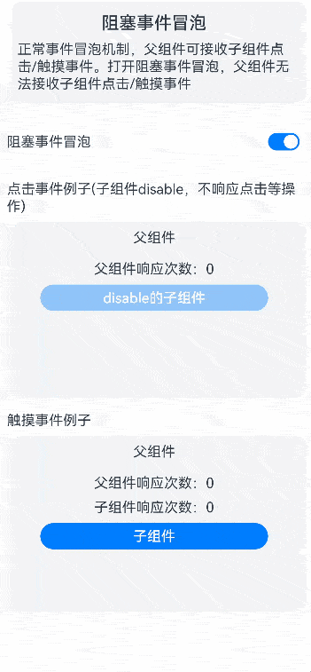

# 阻塞事件冒泡

### 介绍

本示例主要介绍在点击事件中，子组件enabled属性设置为false的时候，如何解决点击子组件模块区域会触发父组件的点击事件问题；以及触摸事件中当子组件触发触摸事件的时候，父组件如果设置触摸事件的话，如何解决父组件也会被触发的问题。

### 效果图预览



**使用说明**：

1. 开启使能开关，在点击事件场景下，点击子组件，不能触发本身和父组件的点击事件。
2. 在触摸事件场景下，触摸子组件，能够触发子组件的触摸事件，不会触发父组件的触摸事件。
3. 关闭使能开关，在点击事件场景下，点击子组件，不触发子组件点击事件，但能够触发父组件点击事件。
4. 在触摸事件场景下，触摸子组件，触发子组件的触摸事件和父组件的触摸事件。

### 实现思路

**场景1：enabled的值为false时，点击Button按钮，会导致父组件的点击事件触发**

对Button组件包裹一层容器组件，并设置[hitTestBehavior](https://developer.huawei.com/consumer/cn/doc/harmonyos-references-V4/ts-universal-attributes-hit-test-behavior-0000001815767744-V4?catalogVersion=V4)属性，
属性值设置为HitTestMode.Block，可阻止事件的冒泡。具体代码可参考[EventPropagation.ets](./src/main/ets/view/EventPropagation.ets)。

```
@Component
struct ClickEvent {
  // 初始化控制使能开关变量
  @Consume isEnabled: boolean;
  // 父组件响应次数
  @State parentCompResponseTimes: number = 0;

  build() {
    Column() {
      Text($r('app.string.event_propagation_click_event_title'))
        .width($r('app.string.event_propagation_common_container_width'))
        .textAlign(TextAlign.Start)
      Column() {
        Text($r('app.string.event_propagation_parent_component_text'))
          .margin($r('app.string.ohos_id_elements_margin_vertical_m'))
        // 父组件响应次数
        Row() {
          Text($r('app.string.event_propagation_parent_component_response_times_text'))
          Text(`${this.parentCompResponseTimes}`)
        }
        .margin({
          top: $r('app.string.ohos_id_elements_margin_vertical_m'),
          bottom: $r('app.string.ohos_id_elements_margin_vertical_m')
        })

        Column() {
          Button($r('app.string.event_propagation_child_component_response'))
            .width($r('app.integer.event_propagation_button_width_size'))
            .height($r('app.integer.event_propagation_button_height_size'))
            .borderRadius($r('sys.float.ohos_id_corner_radius_button'))
            .enabled(false)
            .onClick(() => {
            })
        }
        /*
         TODO：知识点：在onClick事件里，需要将Button按钮包裹一层容器组件，在此容器组件通过使用hitTestBehavior来阻止事件冒泡(子组件向父组件透传onClick事件)，
          hitTestBehavior的属性值设置为HitTestMode.Block。
         */
        .hitTestBehavior(this.isEnabled ? HitTestMode.Block : HitTestMode.Default)
      }
      .width($r('app.string.event_propagation_common_container_width'))
      .height($r('app.integer.event_propagation_button_click_event_area_height'))
      .backgroundColor($r('app.color.ohos_id_color_sub_background'))
      .alignItems(HorizontalAlign.Center)
      .onClick(() => {
        // 冒泡事件发生时，该回调不会触发
        this.parentCompResponseTimes++;
      })
      .margin({ top: $r('app.string.ohos_id_elements_margin_vertical_m') })
      .borderRadius($r('app.string.ohos_id_corner_radius_default_m'))
    }.margin({ top: $r('app.string.ohos_id_elements_margin_vertical_l') })
  }
}

```

**场景2：触摸事件中，当子组件触发触摸事件的时候，父组件如果设置触摸事件的话，也会触发**

在onTouch函数中执行event.stopPropagation()可阻止冒泡。具体代码可参考[EventPropagation.ets](./src/main/ets/view/EventPropagation.ets)
```
@Component
struct TouchEvent {
  // 初始化控制使能开关变量
  @Consume isEnabled: boolean;
  // 父组件响应次数
  @State parentCompResponseTimes: number = 0;
  // 子组件响应次数
  @State childCompResponseTimes: number = 0;

  build() {
    Column() {
      Text($r('app.string.event_propagation_touch_event_title'))
        .width($r('app.string.event_propagation_common_container_width'))
        .textAlign(TextAlign.Start)
      Column() {
        Text($r('app.string.event_propagation_parent_component_text_touch'))
          .margin($r('app.string.ohos_id_elements_margin_vertical_m'))
        // 父组件响应次数
        Row() {
          Text($r('app.string.event_propagation_parent_component_response_times_text'))
          Text(`${this.parentCompResponseTimes}`)
        }
        .margin({
          top: $r('app.string.ohos_id_elements_margin_vertical_m'),
          bottom: $r('app.string.ohos_id_elements_margin_vertical_m')
        })

        // 子组件响应次数
        Row() {
          Text($r('app.string.event_propagation_child_component_response_times_text'))
          Text(`${this.childCompResponseTimes}`)
        }.margin({ bottom: $r('app.string.ohos_id_elements_margin_vertical_m') })

        Text($r('app.string.event_propagation_child_touch_component_response'))
          .width($r('app.integer.event_propagation_button_width_size'))
          .height($r('app.integer.event_propagation_button_height_size'))
          .borderRadius($r('sys.float.ohos_id_corner_radius_button'))
          .fontColor(Color.White)
          .textAlign(TextAlign.Center)
          .backgroundColor($r('sys.color.ohos_id_color_focused_bg'))
          .onTouch((event) => {
            if (this.isEnabled) {
              // TODO：知识点：在onTouch事件里，通过调用event.stopPropagation()阻止事件冒泡(子组件向父组件透传Touch事件)
              event.stopPropagation();
            }
            this.childCompResponseTimes++;
          })
      }
      .width($r('app.string.event_propagation_common_container_width'))
      .height($r('app.integer.event_propagation_button_click_event_area_height'))
      .margin({ top: $r('app.string.ohos_id_elements_margin_vertical_m') })
      .backgroundColor($r('app.color.ohos_id_color_sub_background'))
      .borderRadius($r('app.string.ohos_id_corner_radius_default_m'))
      .alignItems(HorizontalAlign.Center)
      .onTouch(() => {
        // 冒泡事件发生时，该回调不会触发
        this.parentCompResponseTimes++;
      })
    }.margin({ top: $r('app.string.ohos_id_elements_margin_vertical_l') })
  }
}
```
### 高性能知识点

不涉及。

### 工程结构&模块类型

```
eventpropagation                                // har类型
|---view
|   |---EventPropagationView.ets                // 视图层-阻塞冒泡特性页面
```

### 模块依赖

本实例依赖common模块来实现[资源](../../common/utils/src/main/resources/base/element)的调用以及[公共组件FunctionDescription](../../common/utils/src/main/ets/component/FunctionDescription.ets)的引用。

### 参考资料

[触摸测试控制(hitTestBehavior)](https://developer.huawei.com/consumer/cn/doc/harmonyos-references-V4/ts-universal-attributes-hit-test-behavior-0000001815767744-V4?catalogVersion=V4)

[触摸事件(onTouch)](https://developer.huawei.com/consumer/cn/doc/harmonyos-references-V4/ts-universal-events-touch-0000001862607321-V4?catalogVersion=V4)


