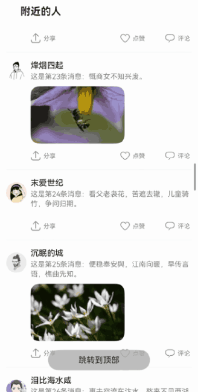

# 长列表滑动到指定列表项动效实现案例

### 介绍

在长列表场景时，当用户在浏览过程中打断时，列表会从第一项开始重新加载，此时我们使用[scrollToIndex](https://developer.huawei.com/consumer/cn/doc/harmonyos-references/ts-container-scroll-0000001821000913#ZH-CN_TOPIC_0000001821000913__scrolltoindex)跳转到某个列表项时，当开启smooth动效时，会对经过的所有item进行加载和布局计算，当大量加载item时会导致性能问题，影响用户体验。因此我们使用[currentOffset方法](https://developer.huawei.com/consumer/cn/doc/harmonyos-references/ts-container-scroll-0000001821000913#ZH-CN_TOPIC_0000001821000913__currentoffset)获取并记录偏移量，然后使用[scrollTo方法](https://developer.huawei.com/consumer/cn/doc/harmonyos-references/ts-container-scroll-0000001821000913#ZH-CN_TOPIC_0000001821000913__scrollto)跳转到上次浏览记录功能，可以流畅滑动到上次列表的位置。

### 效果图预览



### 使用说明

1. 进入页面，第一次点击**跳转到上次浏览记录**，由于第一次没有记录，所以滑动到固定1000vp的位置。
2. 此时按钮变成**跳转到顶部**，再次点击按钮，列表滑动到顶部，并同时记录上一次的位置坐标。
3. 此时按钮变回为**跳转到上次浏览记录**，点击按钮，观察到列表流畅滑动到上次浏览位置。

### 实现思路

本例涉及的关键特性和实现方案如下：

1. 使用LazyForEach+cachedCount+@Reusable实现懒加载列表，并且缓存附近组件。源码参考[ListSlideToHistory.ets](./src/main/ets/view/ListSlideToHistory.ets)和[OneMoment.ets](./src/main/ets/view/components/OneMoment.ets)。

   ```typescript
   List({ space: ListConstants.LIST_SPACE, scroller: this.listScroller }) {
      LazyForEach(momentData, (moment: FriendMoment) => {
       ListItem() {
         OneMoment({ moment: moment })
       }
   }, (moment: FriendMoment) => moment.id)
   }
   .cachedCount(this.cachedCountNumber)
   .width($r('app.string.list_slide_to_history_layout_100'))
   .height($r('app.string.list_slide_to_history_layout_100'))
   .listDirection(Axis.Vertical)
   .divider({
      strokeWidth: $r('app.integer.list_slide_to_history_divider_width'),
      color: $r('app.color.list_slide_to_history_divider_color'),
      startMargin: $r('app.integer.list_slide_to_history_list_divider_margin'),
      endMargin: $r('app.integer.list_slide_to_history_list_divider_margin')
   })
   .onScrollIndex((first: number) => {
      this.firstIndex = first;
   })
   ```
2. 在页面返回/退出等需要历史记录的地方，使用currentOffset方法来获取当前偏移量并存储到本地，本例在跳转到Top时将偏移量记录到成员变量historyOffset中。源码参考[ListSlideToHistory.ets](./src/main/ets/view/ListSlideToHistory.ets)。

   ```typescript
   this.historyOffset = this.listScroller.currentOffset().yOffset;
   ```

3. 在跳转时，使用scrollTo+animation动画实现列表滑动。源码参考[ListSlideToHistory.ets](./src/main/ets/view/ListSlideToHistory.ets)。

   ```typescript
   this.listScroller.scrollTo({
     xOffset: 0,
     yOffset: this.historyOffset === 0 ? this.DEFAULT_OFFSET : this.historyOffset,
     animation: { duration: this.ANIMATION_DURATION, curve: Curve.LinearOutSlowIn }
   })
   ```

### 高性能知识点

1. 参考了[长列表加载性能优化](https://developer.huawei.com/consumer/cn/doc/harmonyos-guides/best-practices-long-list-0000001728333749#section5720231172219)，使用了里面的LazyForEach+cacheCount+@Reusable实现长列表不卡顿滑动。
2. 参考了[Scroller](https://developer.huawei.com/consumer/cn/doc/harmonyos-references/ts-container-scroll-0000001821000913#ZH-CN_TOPIC_0000001821000913__scroller)，使用了currentOffset计算偏移量和scrollTo+animation动效流畅滑动来代替scrollToIndex，因为scrollToIndex在长列表场景开启smooth动效时会导致卡顿。

### 工程结构&模块类型

```
   listslidetohistory               // har包
   |---constants                    
   |   |---ListConstants            // 列表常量
   |---model                        
   |   |---BasicDataSource          // 列表LazyForEach数据类 + 图文数据类
   |---view             
   |   |---components            
   |   |   |---ImageText            // 图标+文字组件
   |   |   |---OneMoment            // 列表内图文混排组件
   |   |---ListSlideToHistory       // 附近的人列表
```

### 模块依赖

[@ohos/routermodule(动态路由)](../../common/routermodule)

### 参考资料

1. [长列表加载性能优化](https://developer.huawei.com/consumer/cn/doc/harmonyos-guides/best-practices-long-list-0000001728333749#section5720231172219)
2. [Scroller](https://developer.huawei.com/consumer/cn/doc/harmonyos-references/ts-container-scroll-0000001821000913#ZH-CN_TOPIC_0000001821000913__scroller)
