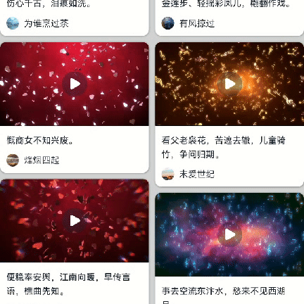

# 视频全屏切换案例

### 介绍

本示例介绍了[@ohos.multimedia.media](https://developer.huawei.com/consumer/cn/doc/harmonyos-references-V4/js-apis-media-0000001821001557-V4)组件和[@ohos.window](https://developer.huawei.com/consumer/cn/doc/harmonyos-references-V4/js-apis-window-0000001820880785-V4?catalogVersion=V4)接口实现媒体全屏的功能。
该场景多用于首页瀑布流媒体播放等。

### 效果图预览



**使用说明**：

* 点击全屏按钮，横屏媒体窗口。
* 点击恢复窗口按钮，恢复媒体窗口。

## 实现步骤

1. 初始化[@ohos.multimedia.media](https://developer.huawei.com/consumer/cn/doc/harmonyos-references-V4/js-apis-media-0000001821001557-V4)的AVPlayer。
  ```ts
  async Init(): Promise<void> {
    await this.release();
    const context = getContext(this);
    // 获取fdSrc用于注册AVPlayer
    context.resourceManager.getRawFd(this.fileName).then(async (value: resourceManager.RawFileDescriptor) => {
      this.avPlayer = await media.createAVPlayer();
      this.isCreate = true;
      this.setSourceInfo(); // 视频信息上报函数
      this.setStateChangeCallback(); // 状态机上报回调函数
      this.avPlayer.fdSrc = {
        fd: value.fd,
        offset: value.offset,
        length: value.length
      };
    });
  }
  ```
2. 当AVPlayer初始化完毕进入initialized状态时，将XComponent和AVPlayer通过surfaceId绑定，这样可以在XComponent组件内实现视频播放功能。比起Video组件，AVPlayer可以更方便自定义全屏动画效果。
  ```ts
  // TODO 知识点：XComponent和AVPlayer通过surfaceId绑定
  setSurfaceID(): void {
    logger.info('play video: surfaceID is:' + this.surfaceID);
    this.avPlayer.surfaceId = this.surfaceID;
  }
  ```
3. 使用显式动画[animateTo](https://developer.huawei.com/consumer/cn/doc/harmonyos-references-V2/ts-explicit-animation-0000001478341181-V2)实现窗口放大效果。
```ts
  // 设置全屏播放展开动画
  animateTo({
    duration: ANIMATE_DURATION,
    onFinish: () => {
      this.isLandscape = !this.isLandscape; // 设置横屏
    }
  }, () => {
    this.isFullScreen = !this.isFullScreen;
  });
```
4. 调用[@ohos.window](https://developer.huawei.com/consumer/cn/doc/harmonyos-references/js-apis-window-0000001820880785)的 getLastWindow 方法获取当前应用内最上层的子窗口，若无应用子窗口，则返回应用主窗口。
5. 利用获取到的窗口对象，调用 setWindowSystemBarEnable 方法设置窗口是否显示导航栏和状态栏。
6. 调用窗口对象的 setPreferredOrientation 方法设置窗口旋转方向以及是否应用重力感应。
7. 调用窗口对象的setWindowLayoutFullScreen方法实现沉浸式布局。
  ```ts
  changeOrientation() {
    // 获取UIAbility实例的上下文信息
    let context = getContext(this);
    // 调用该接口手动改变设备横竖屏状态（设置全屏模式，先强制横屏，再加上传感器模式）
    window.getLastWindow(context).then((lastWindow) => {
      if (this.isLandscape) {
        // 设置窗口的布局是否为沉浸式布局
        lastWindow.setWindowLayoutFullScreen(true, () => {
          // 设置窗口全屏模式时导航栏、状态栏的可见模式
          lastWindow.setWindowSystemBarEnable([]);
          // 设置窗口的显示方向属性，AUTO_ROTATION_LANDSCAPE表示传感器自动横向旋转模式
          lastWindow.setPreferredOrientation(window.Orientation.AUTO_ROTATION_LANDSCAPE);
        });
      } else {
        // 设置窗口的显示方向属性，UNSPECIFIED表示未定义方向模式，由系统判定
        lastWindow.setPreferredOrientation(window.Orientation.UNSPECIFIED, () => {
          // 设置窗口全屏模式时导航栏、状态栏的可见模式
          lastWindow.setWindowSystemBarEnable(WINDOW_SYSTEM_BAR, () => {
            // 设置窗口的布局是否为沉浸式布局
            lastWindow.setWindowLayoutFullScreen(false, () => {
              setTimeout(() => {
                // 设置退出全屏动画
                animateTo({
                  duration: ANIMATE_DURATION,
                  onFinish: () => {
                    this.fileName = '';
                  }
                }, () => {
                  this.isFullScreen = !this.isFullScreen;
                });
              }, TIMEOUT_DURATION);
            });
          });
        });
      }
    });
  }
  ```
### 高性能知识点

1. 本示例使用了[LazyForEach](https://developer.huawei.com/consumer/cn/doc/harmonyos-guides/arkts-rendering-control-lazyforeach-0000001820879609) 进行数据懒加载优化,以降低内存占用和渲染开销。
2. 本示例使用了[@Reusable](https://docs.openharmony.cn/pages/v4.0/zh-cn/application-dev/performance/component-recycle.md/)复用组件优化，提升应用性能。

### 工程结构&模块类型

   ```
   mediafullscreen                                    // har
   |---model                                         
   |   |---BasicDataSource.ets                        // 数据类型文件
   |---util
   |   |---TimeTools.ets                              // 时间轴组件页面
   |---view
   |   |---MediaFullscreen.ets                        // 媒体全屏容器页面
   |   |---XComponentVideo.ets                        // AVPlayer组件页面
   ```

### 模块依赖

1. 本实例依赖common模块来获取[日志工具类logger](../../common/utils/src/main/ets/log/Logger.ets)。

### 参考资料

显式动画[animateTo](https://developer.huawei.com/consumer/cn/doc/harmonyos-references-V2/ts-explicit-animation-0000001478341181-V2)

[LazyForEach](https://developer.huawei.com/consumer/cn/doc/harmonyos-guides-V4/arkts-rendering-control-lazyforeach-0000001820879609-V4)

[@ohos.multimedia.media](https://developer.huawei.com/consumer/cn/doc/harmonyos-references-V4/js-apis-media-0000001821001557-V4)

[@ohos.window](https://developer.huawei.com/consumer/cn/doc/harmonyos-references/js-apis-window-0000001820880785)

[@Reusable](https://docs.openharmony.cn/pages/v4.0/zh-cn/application-dev/performance/component-recycle.md/)

