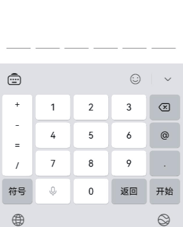

# 验证码布局

### 介绍

本示例介绍如何使用Text组件实现验证码场景，并禁用对内容的选中、复制、光标。

### 效果图预览




**使用说明**

1. 单击组件可弹出输入法
2. 在进行验证码输入时，无法对中间单个数字进行更改，无法选中输入内容，无光标

### 实现思路

1. 因为要禁用复制、选中等功能，这里使用了Text组件，而不是TextInput

    ```typescript
    ForEach(this.codeIndexArray, (item: number, index: number) => {
      Text(this.codeText[item])
        .verifyCodeUnitStyle()
    }, (item: number, index: number) => item.toString())
    ```

1. 绑定输入法，并默认显示键盘
    ```typescript
    this.inputController.attach(true, textConfig);
    ```
   
1. 订阅输入法插入、删除事件，从而获取输入内容
     ```typescript
     this.inputController.on("insertText", (text: string) => {
       if (this.codeText.length >= this.verifyCodeLength) {
         return;
       }
         this.codeText += text;
     })
     this.inputController.on("deleteLeft", (length: number) => {
       this.codeText = this.codeText.substring(0, this.codeText.length - 1);
     })
     ```
1. 由于这里使用的是Text组件，而非TextInput组件，因此需要每次点击目标的组件的时候都重新绑定，并设置键盘的显示，而不能直接使用showSoftKeyboard
   ```typescript
   Flex(){
      //...
   }.onClick(() => {
      this.attach();
   })
   ```
1. 当组件的可视面积变化的时候进行绑定与解绑
   ```typescript
    .onVisibleAreaChange([0.0, 1, 0], async (isVisible: boolean, currentRatio: number) => {
      if (isVisible && currentRatio >= 1.0) {
        await this.attach();
        this.listen();
      }
      if (!isVisible && currentRatio <= 0.0) {
        this.dettach();
      }
    })
   ```

### 高性能知识点

**不涉及**

### 工程结构&模块类型

   ```
   verifycode                                       // har类型
   |---constants
   |   |---VerifyCodeConstants.ets                  // 常量
   |---view
   |   |---VerifyCodeView.ets                       // 视图层-验证码组件
   ```

### 模块依赖

1. [routermodule](../routermodule)：模块动态导入使用
2. [common/utils](../../common/utils)：使用日志功能

### 参考资料

1. [Text](https://developer.huawei.com/consumer/cn/doc/harmonyos-references/ts-basic-components-text-0000001821000881)
2. [inputMethod](https://developer.huawei.com/consumer/cn/doc/harmonyos-references/js-apis-inputmethod-0000001774281542)